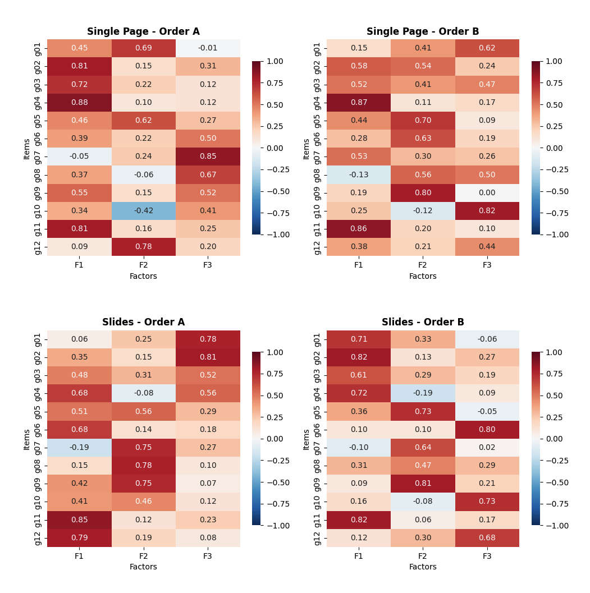
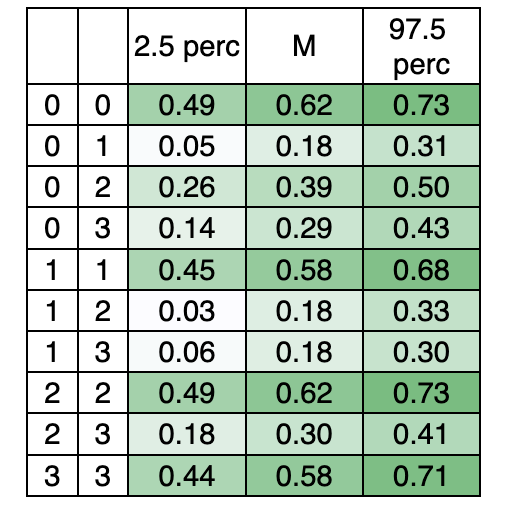

# UX Research & Data Analysis Portfolio  
**Three connected case studies:** Online survey design & psychometrics · Behavioral Analytics · Website Usability

**Role & tools:** UX Researcher / Data Analyst — Python (v3.14.4) (Pandas, NumPy, SciPy), Google Analytics, SPSS, Excel, LimeSurvey
**Domain:** Department of Psychology website (University)

---

## Executive summary — what this portfolio demonstrates
This portfolio consolidates three case studies from a single research program on an academic website. The work combines survey experimentation, psychometrics, web analytics, user feedback, and usability analysis to improve measurement validity and guide practical website improvements—showing how design choices in online surveys and websites affect data validity, user behavior, and prioritization decisions.

Controlled questionnaire variants were tested to quantify how interface-level design decisions affect data quality, response behavior, and measurement structure. Results were then cross-checked with Google Analytics to validate self-reports and establish realistic usage constraints (mobile-first, short visits). Finally, perceived usability and open-ended feedback were synthesized into an implementation-oriented recommendation set for site improvement.

### Strongest outcomes (what was delivered)
- Identified measurement instability caused by survey UI design, preventing misleading comparisons and broken benchmarks. Evidence-based survey-design guidance to protect data quality and measurement validity in web-based questionnaires (layout, open-ended input design, and matrix/question order implications).
- A survey + Google Analytics consistency check to validate self-reports, identify perception gaps, and highlight practical UX constraints (mobile-first, short visits).
- A mixed-method website usability evaluation translated into a prioritized improvement roadmap (with implementation status and expected impact).

**What teams get from this:** Clear, evidence-based guidance that prevents misleading metrics, noisy A/B tests, incorrect prioritization, and design decisions based on unstable data.

---

## Case studies at a glance
### Case Study 1 — Web-survey design & response quality
- Tests how **layout** (one-page vs. slide-by-slide) and **input field size** affect engagement (completion time, non-response, response length).
- Determines how **matrix question arrangement and item order** influence factor structure and inter-item correlations, assessing the impact of visual proximity on psychometric outcomes.

### Case Study 2 — Consistency check: Google Analytics vs. survey self-reports
- Assesses consistency between objective behavioral data (Google Analytics) and subjective self-reports to validate user perceptions.
- Compares aligned indicators (time-on-site, device mix, audience skew) to validate perceptions, identify gaps, and reduce decision risk.

### Case Study 3 — Website usability evaluation & improvement roadmap
- Evaluates and improves perceived usability of the Department of Psychology website based on quantitative user ratings and qualitative feedback.
- Translates findings into prioritized recommendations.

---

## Responsibilities
End-to-end ownership across research design, data preparation, statistical analysis, qualitative coding, synthesis, and recommendations.

- Designed the research structure across three case studies (survey architecture design in LimeSurvey; survey experiment + GA alignment + website usability evaluation).
- Cleaned and harmonized structurally different datasets across multiple survey variants in Python, including removal of incomplete responses, bot/outlier filtering, and format standardization to ensure data quality and cross-format comparability before analysis.
- Executed statistical analyses (Mann–Whitney U, chi-square, ANOVA, PCA/factor-structure evaluation, bootstrap comparisons).
- Defined alignment points (survey ↔ GA), compared patterns, interpreted discrepancies through cognitive and methodological lenses, and translated findings into UX implications.
- Designed the evaluation structure, analyzed usability ratings, coded open-ended feedback into themes, and quantified frequency patterns for prioritization.
- Synthesized results into decision-ready implications and a practical recommendation set with status tracking and expected impact.

---

# Case Study 1 — Web-survey design and response quality

## Why this matters
Web survey interfaces are not neutral containers: spacing, grouping, and item order can shape respondents’ behavior (engagement, non-response, response length), how they interpret questions, and how constructs emerge statistically—especially in matrix/grid designs (inter-item correlations, factor structure). This case study tested how survey layout and visual design choices influence response behavior and psychometric outcomes, and how they create hidden measurement differences across survey variants.

The goal is to provide practical guidelines for designing more effective web questionnaires to collect higher-quality and more reliable data, and to provide empirical evidence on the effects of visual design characteristics on respondent behavior during questionnaire completion.

If layout-induced bias went unnoticed, usability scores could be misleading, leading to incorrect conclusions, broken benchmarks, and unreliable comparisons across studies or time.

## Research questions
- **RQ1:** Does a one-page vs. a slide presentation change completion time?
- **RQ2:** Do open-ended input field sizes affect (a) response participation and (b) response length?
- **RQ3:** Do matrix layout and item order change correlations and factor structure (measurement equivalence risk)?

## Analytical framework
### Hypothesis-driven analysis → results
- **H0:** No statistically significant difference in completion time between single-page and slides. ✅ Confirmed  
- **H1a:** Non-response proportion does not depend on input box size (open-ended). ❌ Not confirmed  
- **H1b:** Text length does not depend on input box size (open-ended). ⚠️ Partially confirmed  
- **H2:** Grid question order + presentation mode (one page vs. slides) results in different factor structures. ✅ Confirmed  
- **H3:** Grid question order + presentation mode (one page vs. slides) leads to different inter-item correlations. ✅ Confirmed  

### Quantitative analyses used
1. **Descriptive statistics:** summarize sample characteristics and response distributions.  
2. **H0:** **Mann–Whitney U test** — compare completion time across formats.  
3. **H1a:** **Chi-square test** — relationship between answer box size and number/length of open-ended responses.  
4. **H1b:** **ANOVA** — response length differences across format, order, and answer box size.  
5. **H2 (measurement structure checks):**  
   - **KMO** (sample adequacy)  
   - **Bartlett’s test** (suitability for factor analysis)  
   - **PCA** (latent structure among questionnaire items)  
6. **H3:**  
   - **Bootstrapping** — compare average strength of inter-item correlations between question groups  
   - **Heatmaps** — visualize inter-item correlations across questionnaire variants  

## Project context and dataset
**Survey instrument:** 21 questions (demographics + 13 usability items + 3 open-ended prompts)

**Four questionnaire variants combined:**
- Presentation format: **One page (1P)** vs **slide-by-slide (Sl)**
- Matrix item order: **Order A** vs **Order B**
- Open-ended input field: **Small** vs **Large** input box

**Data & sample:** 3,896 recorded accesses → after bot removal, **N = 500 usable responses**  
**Split:** 1P: 259 (51.8%), Sl: 241 (48.2%)  
Most respondents were students (73.7%); 80% were female; 74.2% reported a positive or very positive website impression.

## Key findings
### Finding 1 — Completion time was stable across formats
- Layout (1P vs. slides): efficiency was stable. Completion time did not differ meaningfully across layouts, indicating similar efficiency once users adapted.
- **Implication:** Format choice can be guided by UX constraints (screen size, interaction model) without assuming slower completion, but measurement equivalence still needs attention (see Finding 3).

### Finding 2 — Larger open-ended boxes improved participation; richer responses depended on format and box size
- Open-ended engagement was limited: 29.2% answered at least one open-ended question; 4.4% answered all three.
- Input-field size did not consistently increase responses for every open-ended item. However, the relationship between input size and answering at least one open-ended question was statistically significant: **χ²(1,500)=5.95, p=0.014**.
- For response length, neither format nor box size alone was significant; however, the interaction was significant: large boxes produced longer responses specifically in slide-based presentations: **F(1,106)=4.49, p=0.03**.

### Finding 3 — Matrix order and proximity changed inter-item correlations and factor structure
- Across variants, the scree plot suggested one dominant usability component, but factor loadings differed substantially between the four questionnaire variants. Items shifted between components depending on format/order.
- Bootstrap comparisons showed: within-variant correlations were much higher than between-variant correlations, indicating each variant was internally coherent but structurally different from the others.
- Heatmaps showed item proximity effects: when items were adjacent, the g04–g06 correlation was high in Order A (close placement) but lower in Order B (greater separation), indicating a drop as item distance increased.

## Implications — “Do / Don’t” guidance for survey design
- Use large open-ended inputs to increase the likelihood of capturing at least one written response.
- Use **Slides + Larger input field** when the goal is richer qualitative detail (longer responses).

**Most decision-relevant (highest business risk):**
- Avoid mixing formats + item orders if the goal requires comparability/stability (e.g., before/after redesign, cohort comparisons, A/B tests). Minor presentation changes can shift inter-item correlations and factor structure, introducing measurement error and threatening equivalence.
- Don’t treat matrix layout and sequencing as “just UI.” Proximity and order can reshape correlations and factor structure. Treat UI as part of the measurement instrument (not a wrapper).
- **Note:** Factor loadings differed substantially across versions. This means the same “usability score” may represent different underlying constructs across versions, so comparing results across versions can introduce measurement error.

## Artifacts (Case Study 1)
- **Artifact A:** Python notebook (data harmonization + hypothesis tests): cleaning, bot/outlier filtering, dataset harmonization across formats, hypothesis testing
- **Artifact B:** Analysis tables: Mann–Whitney U, chi-square, ANOVA outputs, bootstrap correlation summary, factor structure and inter-item correlation visuals
- **Artifact C:** Psychometrics visuals:
  - Scree plot, factor loading summaries
  - Correlation heatmaps (visual comparison across variants)
  - Bootstrap correlation summary table (within-variant vs between-variant mean correlations)

---

# Case Study 2 — Consistency between Google Analytics and survey responses

## Objective
This analysis explored the relationship between users’ self-reported experiences and actual behavior on an academic website. Google Analytics data were combined with survey responses to assess how accurately users perceive their interaction patterns.

Each data type has limitations and requires cautious interpretation. Self-reported time estimates may be biased due to recall and perception limitations; log data may be affected by measurement and reliability issues.

**Goals:** validate self-reports, identify perception gaps, and improve confidence in conclusions through mutual cross-validation.

## What was compared (aligned indicators)
- **Time-on-site:** survey typical visit duration vs GA average session duration
- **Device usage:** survey primary device vs GA device distribution
- **Audience skew check:** survey gender vs GA gender distribution (as available in GA reporting)

## Key comparisons and interpretation
| Indicator | Survey (self-report) | Google Analytics (logs) | What it suggests |
|---|---:|---:|---|
| Typical time on site | Most reported 5–15 minutes | Avg session duration ≈ 5:30 | Practical alignment; small estimation bias expected due to recall limitations |
| Primary device | 55.8% mobile | 70.5% mobile | Mobile-first confirmed; self-report modestly underestimates habitual mobile use |
| Gender distribution (representativeness check) | 80% female | 68.7% female | Likely sampling differences (survey subset vs all traffic); directional agreement supports a plausible audience match |

## Implications
- Prioritize mobile-first usability because both measures point to mobile as the primary access channel.
- Optimize for short, task-oriented visits: navigation and information hierarchy should support fast orientation.
- Use GA as a representativeness check (e.g., gender, device mix) as a practical sanity check when a perfect sampling frame is not available.
- Use combined data sources for mutual cross-validation to reduce decision risk: scalable behavioral evidence (“what”) plus contextual user intent (“why”) strengthens prioritization and recommendations.
- Note: Log data can be affected by non-human traffic (bots/spiders), incomplete coverage due to consent and blocking, and event-based metric definitions.

**Next step:** repeat the consistency check after major design changes and track shifts in device usage and session patterns.

## Artifacts (Case Study 2)
- **Artifact D:** GA screenshot pack (sanitized): device distribution and session duration screenshots used to ground the cross-validation narrative

---

# Case Study 3 — Department of Psychology website usability evaluation

## Context
The Department of Psychology website served multiple audiences (students, faculty, professors, assistants, prospective students) but showed signs of friction and a need for further evolution: users struggled to find timely academic information, and key workflows (e.g., experiment registration) created confusion.

## Problem
Users reported friction in finding time-sensitive academic information and completing key workflows (notably experiment registration).

## Objective
Quantify perceived usability, identify recurring pain points through open-ended feedback, and translate findings into prioritized recommendations for information architecture, content governance, mobile experience, workflow feedback, and reliability.

**Focus:** perceived usability + qualitative feedback → actionable improvements

## Methods
- Structured usability survey (Likert ratings, 1–5 scale across core usability dimensions)
- Open-ended questions (problems, missing info, improvement suggestions)
- Data prep/analysis in Python; qualitative coding in Excel for frequency-based prioritization

## Key results
### Quantitative highlights
- **Strengths:** loading speed 4.51, navigation 4.34, learnability 4.36.
- **Opportunities (lower ratings):** course description usefulness 3.58, news/updates 3.74, experiment registration 3.64.

### Qualitative themes (recurring pain points)
1. **Content quality and freshness**
   - Outdated or incomplete information; limited file availability
   - Scattered details on projects, events, opportunities, extracurricular activities
2. **Information architecture and findability**
   - Exam results difficult to locate; poor visibility of key student information; lacking privacy controls
   - Faculty information, schedules, resources, and course materials perceived as disorganized/fragmented
3. **Mobile responsiveness and navigation consistency**
   - Inconsistent navigation patterns and weak mobile experience reduce efficiency for mobile-first users
4. **Workflow and system feedback issues**
   - Experiment registration perceived as disorganized; technical difficulties reported
   - Technical instability during peak periods (e.g., exam sessions)
   - Lack of notifications for important updates (exam results, news, deadlines)

## Recommendations (prioritized)
1. **Content governance:** update cadence, ownership, streamlined publishing workflow
2. **Information architecture:** dedicated high-visibility sections (exam results, course materials/resources, projects/activities, faculty info, calendars/deadlines, FAQ)
3. **Design improvements:** mobile-first responsiveness, clearer hierarchy and scannability, modernized UI visuals
4. **Experiment registration:** simplified flow, clearer steps, confirmations/errors, transparency improvements
5. **Enhancements:** notifications, English-language support

## Expected impact
- Clearer, expanded information architecture reduces search effort and improves findability
- Faster access to time-sensitive academic information (exams, deadlines, updates) through regular content updates
- Improved access to academic and faculty information (profiles, schedules, resources, contacts)
- Streamlined navigation and overall usability for students and faculty
- Responsive, mobile-friendly design and improved visual hierarchy
- Higher user trust and satisfaction through transparency, stability, and clearer system feedback/notifications
- More maintainable website via defined content ownership and update routines
- Modern, professional, inclusive web presence supporting the department’s academic mission

## What to do next (to strengthen impact)
- Add a prioritization model (Impact × Effort, frequency of use, risk) to guide sequencing.
- Validate redesigned flows with task-based usability testing:
  - Finding exam results
  - Locating course materials
  - Completing experiment registration  
  (Measure success rate, time-on-task, perceived clarity.)

## Artifacts (Case Study 3)
- **Artifact E:** Usability metrics summary table (1–5): single-page table + bar chart of top strengths vs key friction points
- **Artifact F:** Recommendations matrix (with status): category → recommendation →  status (implemented/partial/excluded)
- **Artifact G:** Full questionnaire item list (items 1–21, including g01–g13)

---

# Core abilities demonstrated
- End-to-end UX research ownership: define research questions, select methods, execute analyses, deliver decision-ready outputs across experiments, behavioral analytics, and usability evaluation.
- Quantitative analysis and statistical judgment: clean/harmonize real datasets and apply appropriate statistical tests (Mann–Whitney U, chi-square, ANOVA), including correct interpretation of interaction effects and responsible claims.
- Survey-design and measurement expertise (differentiator): identify when UI choices affect not only response behavior but also measurement properties (inter-item correlations and factor structure), and translate this into practical guidance that protects comparability.
- Cross-validation with behavioral analytics: align self-reported behavior with Google Analytics, quantify perception gaps, and use the combined picture to support strategic priorities (e.g., mobile-first UX, support for short task-oriented visits).
- Mixed-method synthesis that leads to action: convert qualitative feedback into structured themes and synthesize with quantitative metrics to produce evidence-based recommendations.
- Product-minded recommendations and prioritization: translate findings into an actionable roadmap (information architecture, content governance, mobile UX, workflow feedback), including status tracking and expected impact.
- Technical fluency and reproducibility: package work into stakeholder-friendly artifacts (Python notebooks, analysis tables, heatmaps, coded theme sheets) supporting transparency, reuse, and collaboration.

---

# Full questionnaire item list
1. Please indicate your gender.  
2. Please indicate your role during today’s visit to the Department of Psychology website.  
3. How often do you visit the Department’s website?  
4. How much time do you usually spend on the website during a typical visit?  
5. What is your overall impression of using the Department of Psychology website?  
6. (g01) The overall appearance and design of the website are attractive.  
7. (g02) The homepage provides a clear overview of the website’s structure and logic.  
8. (g03) I always know where to find the information I need.  
9. (g04) It was easy to learn how to navigate the website.  
10. (g05) The information provided on the website is useful, complete, and clear.  
11. (g06) The language and terminology used are easy to read and understand.  
12. (g07) Course descriptions are very helpful when choosing elective subjects.  
13. (g08) I find useful information in the “News and Updates” section.  
14. (g09) The website’s information is updated regularly.  
15. (g10) I can easily and quickly book an appointment for experiments.  
16. (g11) I think future students can easily learn how to use the website.  
17. (g12) I am satisfied with the website’s loading speed.  
18. (g13) I access the website more often from a mobile device than from a computer.  
19. Have you encountered any problems or negative experiences while using the website? If yes, which ones?  
20. What type of information should be added to the website?  
21. Do you have any specific suggestions for improving the Department of Psychology website?  

# Research Artifacts

This part contains supporting tables, figures, and summaries referenced across the three case studies.
All artifacts are presented in Markdown-friendly formats for transparency and reproducibility.

## Analysis tables pack (PNG exports)

---

## 📊 Case Study 1 — Quantitative Tables

### Test: Completion time (Mann–Whitney U  Test)**

**Table 7.** Questionnaire Completion Time between questionnaire formats

| Question Format | N | Median Time | Mann–Whitney U | p-value |
|-----------------|---|-------------|----------------|---------|
| One page (total) | 257 | 151.00 | 28143.5 | 0.86 |
| Slides (total) | 217 | 153.00 | — | — |
| One page (OP+) | 85 | 259.00 | 2351.5 | 0.64 |
| Slides (OP+) | 58 | 286.00 | — | — |
| One page (OP−) | 172 | 124.00 | 13329.9 | 0.69 |
| Slides (OP−) | 159 | 131.00 | — | — |

Note: OP+ – respondents provided answers to open-ended questions; OP− – respondents did not provide answers to open-ended questions

**Finding:**  
✅ H0 hypothesis - Confirmed → Completion time did not differ significantly between single-page and slide-based formats after excluding outliers.

**Implication:**  
Layout choice does not affect efficiency. Suggesting both formats allow users to establish a steady response pace once accustomed.

---

### Test: Chi-square (χ²)

**Table 8.** Open-ended response rate (χ²) - Association between answer-box size and the number and length of responses provided.

| Question | χ² | p-value | Phi (φ) |
|--------|----|---------|---------|
| Problems / Negative Experiences | 0.748 | 0.387 | 0.039 |
| Additional Information | 2.201 | 0.138 | 0.066 |
| Suggestions for Improvement | 3.786 | 0.052 | 0.087 |
| **All Questions (Total Sample)** | **5.951** | **0.014** | **0.110** |
Note: Statistically significant at α = 0.05.

**Finding**:  
In this case, Total Sample, the results were statistically significant: χ²(1, 500) = 5.95, p = 0.014, φ = 0.11. 
H1a: - ❌ Not confirmed → Larger answer boxes increased the likelihood that respondents answered at least one open-ended question.
---

### Test: Two-Way ANOVA

**Test effects of format and answer-box size on response length** 
**Table 9. Response Length — Two-Way ANOVA**

| Source | SS | df | MS | F | p |
|------|----|----|----|---|---|
| Question format | 84,432.29 | 1 | 84,432.29 | 2.82 | 0.09 |
| Answer-box size | 17,477.57 | 1 | 17,477.57 | 0.58 | 0.45 |
| Format × Box size | 134,274.45 | 1 | 134,274.45 | 4.49 | 0.03 |
| Residuals | 3.17e6 | 106 | 29,925.69 | — | — |

**Finding:**  
Neither format nor box size alone affected response length, but their interaction did. The interaction is significant (F(1,106)=4.49, p=0.03):

⚠️ H1b hypothesis - Partially confirmed → Larger boxes and slide format produced longer responses.

---

### Grid questions / Factor loading summaries (Variant-by-variant) + correlation heatmaps showing proximity/order effects.
**Table 10.Kaiser–Meyer–Olkin (KMO) measure and Bartlett’s test of sphericity**

# table

The Kaiser–Meyer–Olkin (KMO) measure was 0.88, exceeding the recommended value of 0.6 (Kaiser, 1970, 1974). Bartlett’s test of sphericity (Chi-Square = 1424.59) was also statistically significant (p < 0.01), indicating that the correlation matrix is factorable.

**Suitability checks:**
- KMO = 0.88
- Bartlett’s test χ² = 1424.59, p < 0.01

**🧠 Factor Analysis & Correlations**

Figure shows the **Eigenvalues** of the components for the four questionnaire variants. 

Although a dominant usability component appeared across variants, factor loadings differed substantially by format and item order.

By applying Cattell’s criterion, three components was kept for further analysis.

**Factor Loadings Across Questionnaire Variants**   

These heatmaps show how **questionnaire format** (Single Page vs. Slides) and **item order** (Order A vs. Order B) influence the **latent structure** of the questionnaire (factor loadings).

**How to read**
- Rows:  matrix-type questionnaire items (g01–g12)
- Columns: extracted factors (F1–F3)  
- Higher absolute values indicate stronger loadings - red colour

**Findings**
✅ H2 hypothesis - Confirmed → Factor loadings differ across variants: Different question orders and formats led to different factor structures. 

As a result, comparing scores across formats or orders can introduce **measurement error**.

**Examples:** In the slide-based format with order B (Sl_B), items related to visual design and navigation (g01-g04, g11) formed a dominant main component. In other variants, the main component shifted toward information quality and content-related items (e.g., g05, g06, g07, g08, g09). In the slide-based, Order A (Sl_A) variant, the same design-related items loaded on a weaker, lower-order component with reduced explained variance. Individual items such as g06, g07, and g12 loaded on different components depending on the questionnaire variant, sometimes showing secondary loadings, indicating instability in the latent structure.

**Why this matters for teams**
- **Benchmark risk:** scores may not be comparable across versions  
- **Trend risk:** longitudinal comparisons can be misleading  
- **Experiment risk:** layout changes can create noisy or false A/B effects

**Decision implication**

When results must be comparable (tracking, benchmarking, pre/post changes), **standardize layout and item order**, or treat changes as a **new measurement instrument**.

---

### Inter-Item Correlation Heatmaps

Note. Abbreviations g01–g12 refer to matrix-type questionnaire items

**Finding:**  
Items placed closer together showed stronger correlations than the same items placed farther apart.

**Implication:**  
Visual proximity and item order reshape correlation strength, confirming that layout decisions affect measurement structure.

### Bootstrap Analysis — Mean Inter-Item Correlations

**Method:** 1,000 bootstrap resamples (60% of each sample)

**Finding:**  
Correlations within the same questionnaire variant were consistently higher than between variants.
→ Variants are internally coherent but structurally different, reinforcing comparability risk when mixing formats or orders.

✅ H3 hypothesis - Confirmed → Mixing formats and changing question order can introduce measurement errors by altering correlation strengths and factor structures. Item correlations differ across question orders.

## 📈 Case Study 2 — GA vs Survey

**Figure 6.** 

**Google Analytics data showing access to the Department’s Session duration**

**Table 13.** 

**Average Session Duration by Device and Gender (GA)**

| Device | Female | Male |
|------|--------|------|
| Mobile | 00:00:41 | 00:01:27 |
| Desktop | 00:01:40 | 00:02:13 |

**Table 14.**

**Subjective estimate of time spent on the website during a single session**

| Time range | N | % |
|-----------|---|---|
| < 5 min | 202 | 40.4 |
| 5–15 min | 228 | 45.6 |
| 15–30 min | 42 | 8.4 |
| > 30 min | 11 | 2.2 |
| No response | 17 | 3.4 |

**Finding:**  
Self-reported estimates align well with GA averages, with expected recall bias.

**Figure 8.**
**Distribution of responses to the item “I access the website more often from mobile devices than from a computer” (g13)**
| Item (G13)                 |   N |      % |
| -------------------------- | --: | -----: |
| Strongly disagree          |  42 |  8.40% |
| Mostly disagree            |  72 | 14.40% |
| Neither agree nor disagree |  49 |  9.80% |
| Mostly agree               | 115 | 23.00% |
| Strongly agree             | 164 | 32.80% |

**Finding:**  
Sessions are short and task-oriented, especially on mobile.

**Implication:**  
Navigation and information hierarchy should prioritize fast orientation and quick task completion.

## Case Study 3 — Usability & Recommendations (Markdown)

### Usability Metrics Summary (Likert 1–5)

| Code | Aspect | Mean |
|-----|--------|------|
| G01 | Design attractiveness | 3.55 |
| G02 | Homepage structure clarity | 4.12 |
| G03 | Ease of finding information | 3.89 |
| G04 | Ease of navigation | 4.34 |
| G05 | Information usefulness | 4.13 |
| G06 | Language clarity | 4.33 |
| G07 | Course descriptions | 3.74 |
| G08 | News & updates | 3.58 |
| G09 | Information freshness | 3.90 |
| G10 | Experiment booking | 3.64 |
| G11 | Learnability (future students) | 4.36 |
| G12 | Page loading speed | 4.51 |
| G13 | Mobile access frequency | 3.65 |

### Recommendation Matrix with Status (Website Usability)

This matrix translates quantitative usability ratings and qualitative user feedback into a decision-ready improvement backlog.  
Statuses reflect whether a recommendation was implemented, partially implemented, or excluded.

**Legend:** ✅ Implemented · ⚠️ Partially implemented · ❌ Excluded / not planned

---

## Summary of Priorities
- **Highest impact themes:** Content freshness & ownership, Information Architecture (findability), Mobile-first responsiveness, Workflow clarity (experiment booking), Feedback/notifications.
- **Primary user context:** Mobile-first usage and short, task-oriented visits → prioritize fast orientation, clear pathways, and time-sensitive information access.

---
## Recommendation Matrix (with Implementation Status)

| Category | Recommendations & Improvements | Status |
|---|---|:---:|
| Content governance | - Establish an update cadence for news, exam schedules, elective courses, and deadlines - Assign clear ownership (who updates what) and streamline the publishing workflow to increase faculty participation in content maintenance - Implement a new, easier user flow for updates | ✅ |
| Information architecture — Exam Results Accessibility | - Dedicated exam results section - Privacy controls for sensitive information | ⚠️ |
| Information architecture — Course Materials & Learning Resources | - Centralized and structured course materials - Dedicated page for an online library for learning materials | ✅ |
| Information architecture — Projects & Departmental Activities | - Dedicated page for current/past projects and research results - Dedicated section for awards received by Department members - Dedicated page for events, volunteering, scholarships, and exchange programs - Step-by-step application instructions | ✅ |
| Information architecture — Faculty & Academic Information | - Working hours of student services, libraries, and offices - Centralize instructor profiles (bio, research highlights, photos, office hours, elective schedules) - Improve contact visibility - Academic calendar, deadlines, exam/assignment schedules - Add an FAQ for high-frequency student tasks | ⚠️ |
| Design improvements | - Mobile-first UX: responsive improvements for mobile/tablet - Strengthen information hierarchy, navigation consistency, new content categories, and scannability on smaller screens - Modern visuals for professional appeal (colors, spacing, etc.) | ✅ |
| Experiment registration system | - Simplify the sign-up flow and reduce ambiguity (clear steps, confirmation feedback, error handling) - Improve organization and transparency of participation | ✅ |
| Additional enhancements | - Notifications for exam results and important updates - English-language support for international students | ❌ |

---

## Status Notes
- ✅ Implemented: completed and publicly available on the website of Department of psyhology
- ⚠️ Partially implemented: started but missing key components (e.g., Academic calendar, deadlines, exam/assignment schedules, Add an FAQ for high-frequency student tasks)
- ❌ Excluded: not prioritized due to effort, scope, or constraints

---

